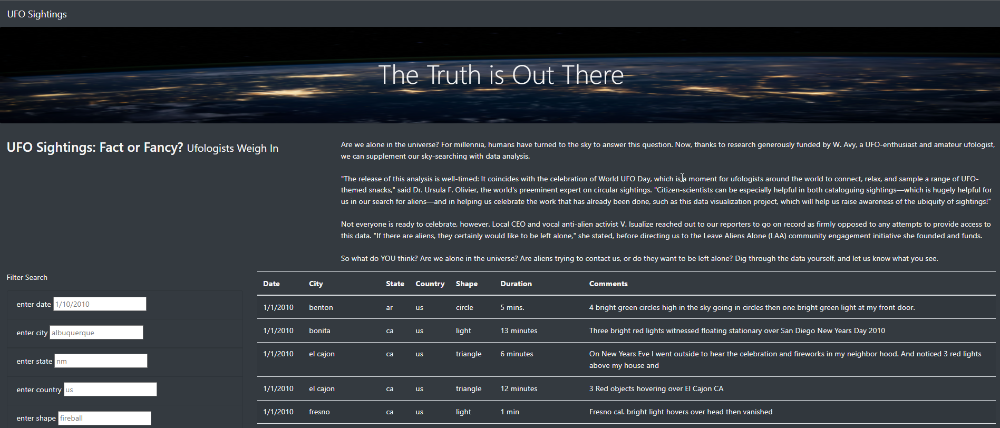
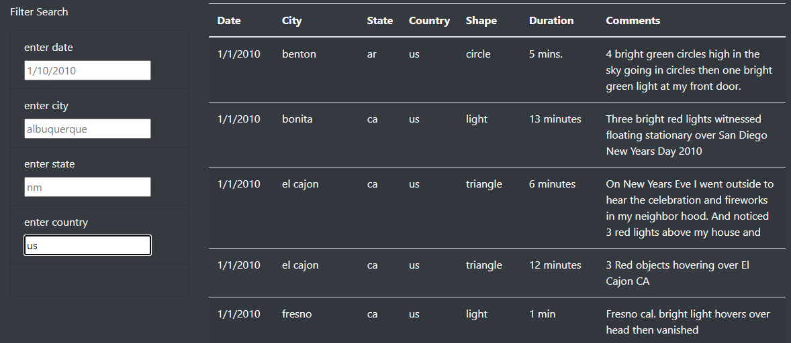
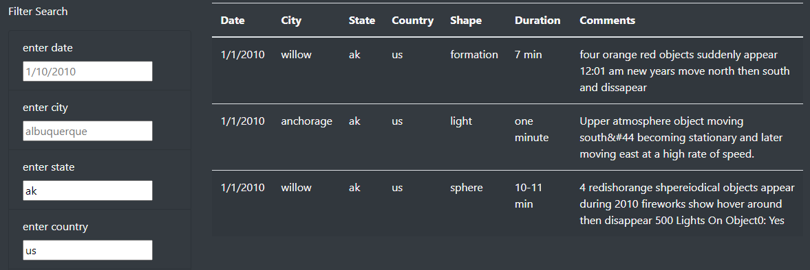

# UFOs

## Overview

This analysis uses Javascript, HTML, and CSS to create an interactive website that allows a user to view and filter the contents of a dataset (provided as a Javascript object). Bootstrap and D3 are used for customization and interactivity.

## Results

To filter the table of results, enter search criteria in one of the filter search boxes to the left of the page. The search is case-sensitive and looks for exact matches, so the example format given in each search box must be followed. After entering search text, trigger table filtering by pressing enter or clicking outside the search box.

Search results may be further refined by entering criteria in multiple search boxes.

To quickly clear all search results, refresh the page by clicking "UFO Sightings" in the navigation bar at the top of the page.

## Summary

### Page Design Drawbacks

The use of the navigation bar to refresh the page and clear filtering options isn't particularly well-labled or intuitive. Removing the navigation bar (since there are no other related pages to navigate between) and adding a "clear filters" button within the Filter Search pane would likely provide a better user experience.

### Opportunities for Additional Development

While the filter search boxes provided do help a user to narrow in on results, their functionality is limited and restricive. The following changes would greatly help to improve this site's versatility:

* More flexible searching: The current case-sensitive, exact string search does not leave room for user error or broad searches. Case insensivity and partial word searching would increase a user's chances of finding results when entering inexact search results. The ability to view all results matching a particular month or year without having to provide a specific date would likewise improve the search experience.

* Sorting: The current design has no provision for users who isn't sure what they're looking for but wish to reorganize the data to see what options exist. Adding sort options to the column headers would help a user to peruse the data based on shapes, cities, countries, etc., without having to filter to a specific option.